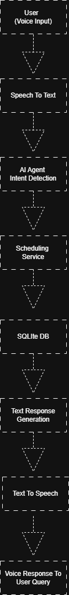

Real-Time Multilingual Voice AI Appointment Agent

Features
- Voice to voice conversation
- Appointment booking
- Conflict handling
- Multilingual support
- Latency logging
- Outbound reminders

Run Instructions

1 Activate virtual environment

venv\Scripts\activate

2 Install dependencies

pip install -r requirements.txt

3 Add OpenAI key in .env

4 Run the system

python backend/main.py

## System Architecture

